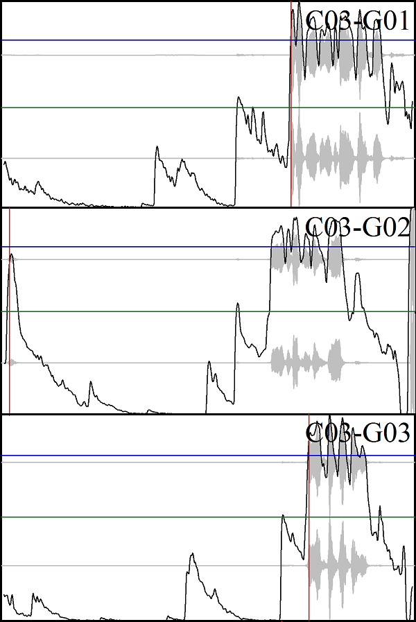

# lab-tools
Tools for experiments and analysis of recorded data, including tools for processing data recorded with _SMI ExperimentCenter_.
* [SpeechOnsetTimes](#SpeechOnsetTimes) - measure speech onset times in _.wav_ files
* [ExCAudioExtract](#ExCAudioExtract) - extract _.wav_ or _.mp3_ files from _SMI ExperimentCenter_ recorded data folders for each subject/stimulus
* [KeypressLogMerge](#KeypressLogMerge) - extract keypress log entries and map them to the corresponding stimulus, from _SMI ExperimentCenter_ recorded data folders for each subject
* [ahk scripts](#ahk-scripts) - workaround for some experimental setups where you need keypress events or mouse click events to trigger stimulus advancement in _SMI ExperimentCenter_

## SpeechOnsetTimes ([praat/](tree/master/praat/))
[Praat](http://www.fon.hum.uva.nl/praat/) script file to analyze SOT from a set of _.wav_ files. Most useful in conjunction with [ExCAudioExtract](#ExCAudioExtract).

#### Usage
* Run Praat (get the latest version [here](http://www.fon.hum.uva.nl/praat/), tested with version 6.0.46/win64).
* Open script ("Praat Objects" window main menu -> Praat -> Open Praat script...) and run (on the script window, main menu -> Run -> Run or Ctrl-R).
* Point to location of audio files to analyze. Selected directory should either contain only a set of _.wav_ files, or subdirectories containing a set of _.wav_ files each.
* Output:
  1. CSV file with measured SOT data that looks like the following:

          Item;SOT(Mean);SOT(Mean-sd);SOT(Pulse)
          C03-G01;7798;6358;7804
          C03-G02;5842;130;173
          C03-G03;7895;7239;7915
          C03-G04;5330;5058;5328
          C03-G05;5283;3059;5294
      "Item" is derived from the audio file name and should contain some form of identifier that allows you to map the data to a specific subject-stimulus pair (i.e., name your audio files accordingly), and the three following columns contain the measured time from the beginning of the file to the speech onset (measured/estimated with three methods, see below).
  2. Image file with graphs representing the wave signature of each audio file with lines signalling the measured times of the speech onset.

      
      The blue line represents the mean intensity levle of the sound file; the green line represents the level of mean minus standard deviation intensity; the red line represents the timing of the first pulse measured by Praat's pulse detection (See below for details).

  If you point the tool to a directory with audio files, one set of output files will be generated in the parent directory of that directory, named **_directory name_.csv** and **_directory name_.png** respectively; if the directory contains subdirectories, the tools expects those to contain a set of audio files each, and produces a set of output files each.
* The tool estimates SOT by three methods and returns times in milliseconds from beginning of audio file. The first two values are calculated by looking for the first frame where audio intensity exceeds the mean intensity or mean intensity minus standard deviation respectively (measured over the whole file). The third value is determined by Praat's [glottal pulse detection](http://www.fon.hum.uva.nl/praat/manual/Voice.html) algorithm. Depending on the recording quality of your audio file in terms of amount of signal noise and ambient noise, any or none of these methods may produce accrate results. To check on the quality, you should always look at the generated graphs (PNG files) before choosing the value you want to use for further analysis.
* Limitations: The graphs image cannot contain more than 72 graphs. Make sure to have no more than 72 audio files in each data folder before using the script. Furthermore, big audio file sizes might lead to high memory consumtion (and Praat program crashes). Make sure to cut the audio files in reasonably sized chunks, e.g. by using the [ExCAudioExtract](#ExCAudioExtract) tool.

#### Credits
This tool was originally created by former HULC Lab member **Xingyu Zhu**.

## ExCAudioExtract
coming soon

## KeypressLogMerge
Extracts keypress events from the recorded data folders' log files (**_participant id_-protocol.txt**). Available as python source or Windows executable built with _pyinstaller_ (see directory _dist/_).

#### Usage
The tool can be placed either inside a recorded data folder of an experiment and run, or called from command-line with the path to the recorded data folder as parameter. It scans the given folder for participant data folders (with names in SMI format like **_participant id_-\[_GUID_\]/**), and for each folder, scans the **stimulus-log.xml** file for stimulus IDs, then scans the **_participant id_-protocol.txt** for keypress log entries, mapping each event to the corresponding stimulus event. The timestamp of each event will be recalculated relative to stimulus onset. The output is a CSV file with one row for each keypress event, that looks like the following:

    Subject ID;Stimulus Name;Stimulus time (ms);Key pressed
    s01;Filler1;7622.222;LeftCtrl
    s01;Filler2;7833.925;RightCtrl
    s01;Filler3;5040.534;Add
    s01;Target1;6912.452;Tab
    s01;Filler4;8002.461;A
    ...

## ahk scripts ([ahk/](tree/master/ahk/))
[AutoHotKey](https://www.autohotkey.com/) script file to send **space key press** after pressing other keys (**LCtrl** and **RCtrl**, or **LShift** and **RShift** ). Used to trigger stimulus advancement and record subject decision at the same time in _SMI ExperimentCenter_. To allow usage of other keys, change the Key names in the scripts (valid key names can be found [here](https://www.autohotkey.com/docs/KeyList.htm)).

Use [KeypressLogMerge](#KeypressLogMerge) to analyze the resulting keypress logs of your experiment.

## Authors

* **Takara Baumbach** ([takb](https://github.com/takb))
* **Xingyu Zhu** (SpeechOnsetTime praat script)

## License

This project is licensed under the GNU General Public License v3.0 - see the [LICENSE](LICENSE) file for details
